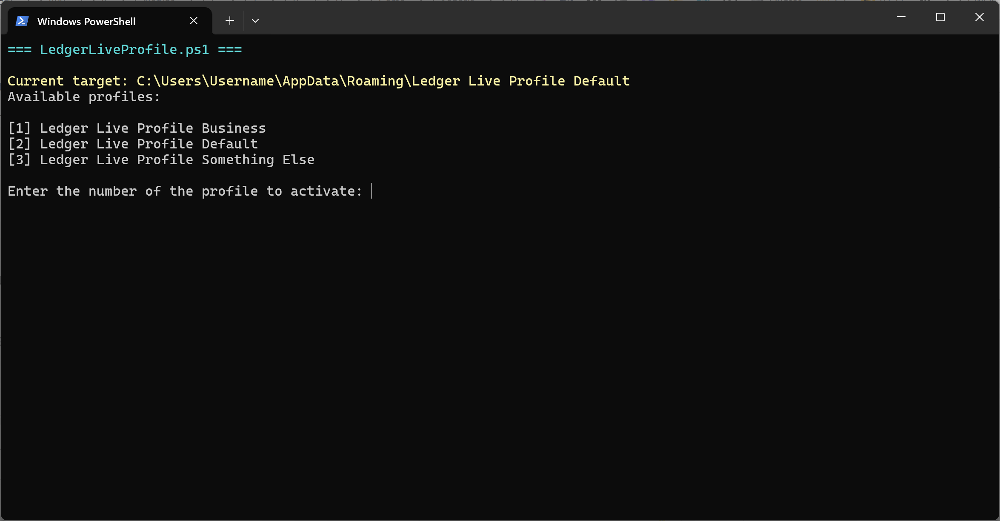

# Ledger Live Profile Switcher

**Ledger Live Profile Switcher** is a PowerShell script for **Windows** that lets you manage **multiple isolated Ledger Live profiles** on a single computer.



It uses **NTFS junctions** to switch the Ledger Live data folder (`%APPDATA%\Ledger Live`) between multiple profile directories such as:

```
%APPDATA%\Ledger Live Profile 1
%APPDATA%\Ledger Live Profile 2
%APPDATA%\Ledger Live Profile 3
```

This keeps accounts from different hardware wallets or users completely separate inside Ledger Live.

---

## Why use this

**Ledger Live does not support multiple user profiles** or isolated wallets on one computer.  
By default, every connected Ledger device shares the same portfolio view and account data.  
This script lets you:

- Maintain **separate data sets** for multiple hardware wallets or users.  
- Prevent Ledger Live from **mixing accounts and balances** across devices.  
- Switch profiles quickly without reinstalling or clearing app data.  

Each profile stores its own accounts, history, and settings independently.

---

## Requirements

- **Windows 10 or 11**
- **PowerShell 5.1+** (installed by default)
- Ledger Live desktop app installed at  
  `C:\Program Files\Ledger Live\Ledger Live.exe`

---

## Installation and Setup

1. **Download the script**
   Save `LedgerWalletProfile.ps1` somewhere stable, e.g.:
   ```
   C:\Users\<YourName>\Documents\LedgerWalletProfile.ps1
   ```

2. **Create your profile folders**  
   Inside your roaming AppData folder (`%APPDATA%` = `C:\Users\<You>\AppData\Roaming`), create:

   ```
   Ledger Live Profile 1
   Ledger Live Profile 2
   Ledger Live Profile 3
   ```

3. **(Migrating an existing Ledger Live installation)**  
   - Close Ledger Live.  
   - Navigate to:
     ```
     C:\Users\<You>\AppData\Roaming\
     ```
   - Rename your existing folder:
     ```
     Ledger Live  →  Ledger Live Profile 1
     ```
   - Run the script and select Profile 1 to continue using that data.

4. **First-time PowerShell setup**  
   Windows may block scripts by default. Open PowerShell once and run:
   ```powershell
   Set-ExecutionPolicy -Scope CurrentUser RemoteSigned
   ```
   This allows you to run trusted local scripts like this one.

---

## Usage

### Launch via PowerShell
Run:
```powershell
& "C:\Users\<YourName>\Documents\LedgerWalletProfile.ps1"
```

You'll see a list of profiles like:

```
Available profiles:

[1] Ledger Live Profile 1
[2] Ledger Live Profile 2
[3] Ledger Live Profile 3
```

Enter a number to select a profile.  
The script will:
1. Point `%APPDATA%\Ledger Live` to the chosen profile.
2. Launch Ledger Live.
3. Wait until Ledger Live is closed.
4. Exit automatically.

---

## Creating a Windows Shortcut

To create a desktop or Start Menu shortcut:

1. Right-click on Desktop or in a folder → **New → Shortcut**.
2. Enter this as the location:
   ```
   powershell.exe -ExecutionPolicy Bypass -File "C:\Users\<YourName>\Documents\LedgerWalletProfile.ps1"
   ```
   (Replace `<YourName>` and adjust the path to where you saved the script.)
3. Click **Next**, name it `Ledger Live Profile Switcher`.
4. Click **Finish**.

**For Start Menu:**
- Press **Win + R**, type `shell:programs`, press Enter.
- Move the shortcut into that folder.

---

## How it works

Ledger Live stores all user data in:
```
%APPDATA%\Ledger Live
```

This script replaces that folder with a **junction** (like a symbolic link) pointing to whichever profile you select.  
Each profile is a fully independent copy of Ledger Live’s data.

When you choose a profile:
- The junction is switched to point to that folder.
- Ledger Live launches and uses that profile’s data.
- When closed, the script terminates.

---

## Troubleshooting

| Issue | Solution |
|--------|-----------|
| **Script won’t run** | Run PowerShell as your user (not admin) and set the policy: `Set-ExecutionPolicy -Scope CurrentUser RemoteSigned` |
| **Ledger Live says "Repair" or "Fresh install"** | You likely picked an empty profile. Switch back to your main one. |
| **Existing “Ledger Live” folder blocks switching** | The script automatically renames real folders to a timestamped backup. |
| **Window stays open after Ledger Live exits** | Make sure your shortcut doesn’t use `-NoExit`. Use only: `powershell.exe -ExecutionPolicy Bypass -File "..."` |
| **Missing profiles** | The script lists only folders beginning with `Ledger Live Profile`. Create new folders following that naming pattern. |
| **Security warning** | PowerShell may warn that the script is unsigned. You can ignore this if you reviewed the code yourself. |

---

## Notes

- Each profile has its own set of wallets, accounts, and settings.
- The script never modifies the profile contents, only the junction link.
- Junction creation normally does **not** require administrator rights.
- You can confirm the active profile by running:
  ```powershell
  (Get-Item "$env:APPDATA\Ledger Live").Target
  ```
  It shows the current path the junction points to.

---

## Example Folder Structure

```
C:\Users\<You>\AppData\Roaming\
├─ Ledger Live               → Junction → Ledger Live Profile 1
├─ Ledger Live Profile 1\
├─ Ledger Live Profile 2\
├─ Ledger Live Profile 3\
```

---

## Uninstalling or reverting to single-profile use
1. Close Ledger Live.  
2. Delete the junction:
   ```powershell
   Remove-Item "$env:APPDATA\Ledger Live" -Force
   ```
3. Rename your preferred profile folder back to:
   ```
   Ledger Live
   ```

---

## License
MIT License – free to use, modify, and share.

---

## Keywords

```
ledger live multiple profiles
ledger live separate wallets
ledger live switch accounts
ledger live data folder junction
ledger live multi user support
ledger live windows script
ledger live profile manager powershell
```
